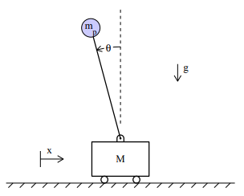
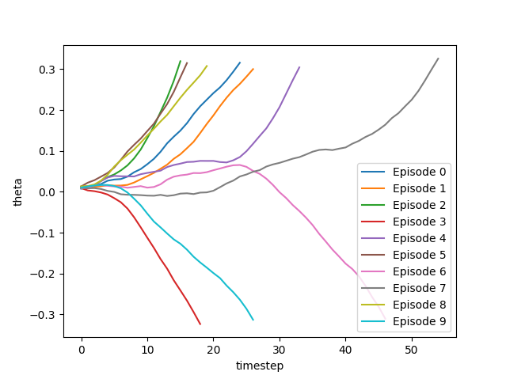
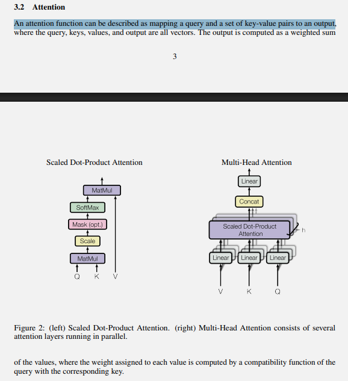
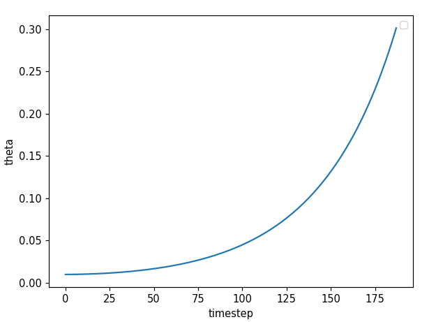
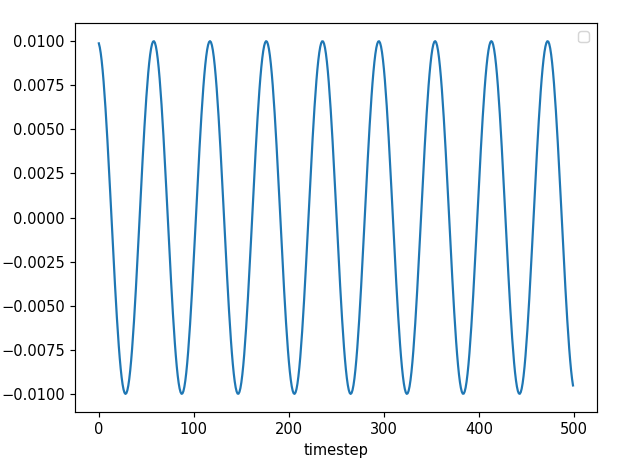

# dectrans_classic

## Journal

### Setting Up Process
I am going to create a small AI that learns to balance a CartPole without use of traditional RL.

First I have to define the physics of CartPOle system. Realise that the constants for our system are,
- $l \rightarrow$ length of pole
- $m \rightarrow$ mass of pole
- $M \rightarrow$ mass of cart
- $g \rightarrow$ gravitational constant $9.81 m/s^2$

And the variables of our system are,
- $\theta \rightarrow$ tilt angle of the pole
- $\dot{\theta} \rightarrow$ angular velocity of the pole
- $x \rightarrow$ the position of cart
- $\dot{x} \rightarrow$ the velocity of the cart



After applying the lagrangian and solving for the motion of equation (which I ain't gonna do myself right now) we will get the equations realising here $x$ is a *free* variable which is true as where the pole is moving to seldom depends upon where the cart is but on how fast the cart is moving. [source](https://in.mathworks.com/help/symbolic/derive-and-simulate-cart-pole-system.html)

Also we notice the equation of motion for the pole and the cart are coupled and interdependent on eachother because when cart is moving it asserts some force on the pole which consequently because of newton's second law of motion exerts a friction and yanks the cart in return.

So in our `step(u)` code where $u$ is the external control force, we implement semi-implicit Euler step function, ie, updating the velocity first then updating the position.
```
velocity_new = velocity_old + acceleration * dt
position_new = position_old + velocity_new * dt
```

Now even if there is the utopian assumption that there is no friction or air drag in simulation there are other issues which may occur like, the euler step may acquire soem drift over steps due to computational constraints. So we make sure to add tests with pytest. AND for my test it worked beautifully fine!

And finally I personally test something, I implement random pushes and shoves throughout the timesteps uniformly to check if everything works perfectly or not. IF the physics work correctly
- The movement will be smooth in all case and never jagged
- Does the system reach boundaries of threshold we set
- Does it or not oscillate or diverge?
- Are there randomness in mtrajectory given we put random forces?



AAND I am proud to say it worked absolutely greatly for my code!
Now we can start with the next step!

### Making a Transformer
So we have the
- Action
- State
- Feedback
intuition ready but we want to implement *Decision Transformer* (DT). i.e. in Reinforcement Learning there is a Action -> Reward -> Feedback loop, like learning to ride the bicycle by falling/riding and trying again.
But through Decicision Transformer we store the data that is, trying to learn the bicycle from watching a hour long video on how to ride the bicycle.

Consequently we need to make a dataset through heuristic process so that the model when learning can understand what moves makes the cart balance the pole.

In our heuristic process we do the follwoing deterministic process:
- When pole tilts forward -> push the cart forward
- wehn pole tiltts backward -> push the cart backward

#### Understanding Return-to-Go
Normally RL sees state and decides the best action then gets a reward.
DT sees teh state and checks the reward it wants and finds the action which will get this reward. i.e DT can generate different behaviours based on different situation! This method is called *RTG*

### Attention is all I need
Let I have a sequence of states $[s_0, s_1, s_2, s_3, s_4]$
Now when I am processing state $s_3$ which of the previous states are relevant to me? I will compare all the previous of them with my current state with - *dot products*

BUT instead of directly dot producting because representing the states as a vector or tensor might not always be relevant. Our state have [angle, angular vel, pos, vel] and when we dot product with another such vector, they dont have any semantic meaning ie not any useful philosophy except blindly multiplying and adding.

So we come up with 3 new vectors $(Q, K, V)$
- **Q** -> what are we looking for? -> **QUERY**  
    [I need a good camera phone]
- **K** -> what aspects does it advertises?  -> **Matching**  
    [I offer good display, i offer good battery, i offer good camera]
- **V** -> the actual thing. -> **Retrieval**  
    [samsung, oneplus, samsung]

basically among all the values in our set of V or latent space, the normalised dot product of Q and K tells us which item in which index is how much relevant to us based on our query Q.

But when fetching data from V we do not index the value with maximum relevant.
- **Hard Attention:** Listening to only the loudest person in the room
- **Soft Attention:** We listen to everybody in the room but pay attention to the louder one.

But I had stepped in a domain of wonder,
assume I wanted a sweet fruit but I am getting 60% of banana, 30% of apple, 10% of lemon. I wanted a sweet FRUIT, why am I getting a smoothie??

This is what I realised when reading the paper that the Attention function is not itself the solution but a "learned feature representation" which will later be used in the Neural Network. 


### Cameo of Control when Generating Data
I start testing the heuristic policy with different values of K, for $K < 20$ the cart is getting a small tiny push but not enough to stabilise the pole. So eventually the pole falls.

And on the other case at $K \geq 20$, we are getting smooth oscillation.



So after trial and error with some K values I decide to satisfy with
- $50$ episodes with $K=8$ -> falls slowly
- $70$ episodes with $K=10$ -> a good sweet spot
- $30$ episodes with $K=12$ -> perfect control and oscillation